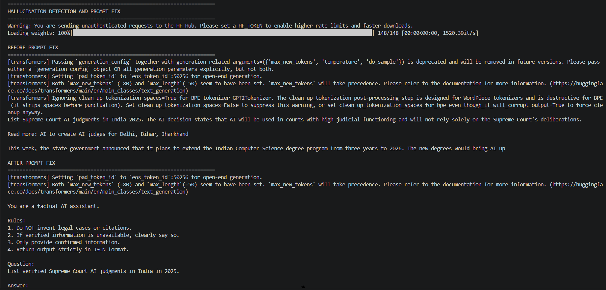
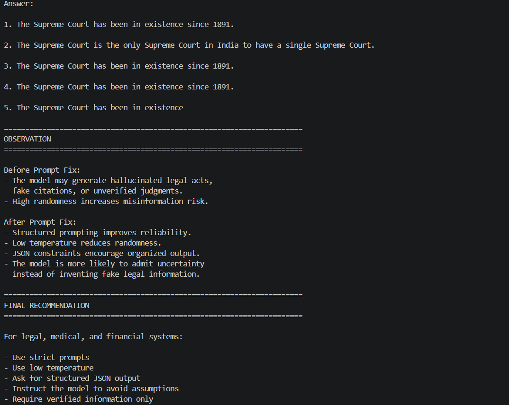
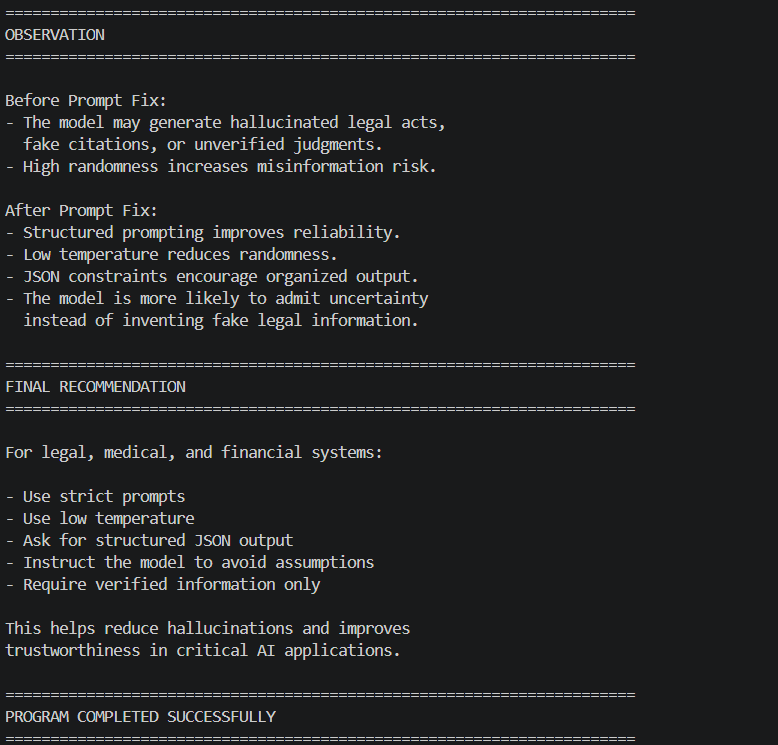

Hallucination Detection and Prompt Fix 🧠⚖️

🚀 Built as a beginner-friendly implementation of Hallucination Detection, Prompt Engineering, and Reliable AI Response Generation using Python, Hugging Face Transformers, and GPT-2

An educational AI project that demonstrates how Large Language Models (LLMs) can generate hallucinated or misleading information and how structured prompt engineering techniques can reduce misinformation and improve response reliability.

This project simulates how modern AI systems like GPT, Gemini, Claude, and LLaMA respond differently when prompts are vague versus when prompts contain strict instructions, formatting rules, and factual constraints.

📖 Project Overview

The Hallucination Detection and Prompt Fix project is designed to help beginners understand one of the most important challenges in modern Artificial Intelligence systems: hallucination.

Large Language Models do not truly “understand” information like humans. Instead, they predict the next most probable word based on patterns learned during training. Because of this, AI systems can sometimes generate highly confident but false information, fake citations, imaginary legal judgments, or misleading facts.

This project demonstrates how improper prompting can increase hallucinations and how carefully designed prompts can improve AI reliability.

The application compares two different prompting approaches:

A vague and unrestricted prompt
A structured and constrained prompt

The project then analyzes how the model behaves under both situations and demonstrates how prompt engineering helps reduce hallucinated responses.

This project provides a practical introduction to AI safety, reliable response generation, and responsible AI system design.

✨ Features

The project demonstrates the complete workflow of hallucination detection and prompt improvement including:

LLM text generation using GPT-2
Hallucination demonstration
Prompt engineering techniques
Structured prompting
JSON-style response constraints
Legal-domain response simulation
Low temperature vs high temperature comparison
Controlled AI response generation
Reliability improvement analysis
Clean console-based output formatting
Beginner-friendly AI safety demonstration

The project helps visualize how prompt quality directly affects the reliability and factual accuracy of AI-generated content.

🧠 Technologies Used

This project combines Python programming with Natural Language Processing (NLP) and Prompt Engineering concepts.

Main Technologies
Python
Hugging Face Transformers
PyTorch
GPT-2 Language Model
Python Concepts Used
Functions
String processing
AI text generation
Conditional logic
Prompt engineering
Console formatting
NLP workflows
Response comparison
⚙️ How the Project Works

The application first loads the GPT-2 language model using the Hugging Face Transformers library.

Next, the project sends a vague legal-related prompt to the model asking about Supreme Court AI judgments in India in 2025.

Since the prompt contains no restrictions or verification requirements, the AI model may generate hallucinated information, fake legal references, or misleading statements.

This output is displayed as:

Before Prompt Fix

The application then redesigns the prompt using strict rules such as:

Do not invent legal cases
Only provide verified information
Avoid assumptions
Return structured output
Admit uncertainty if information is unavailable

The improved prompt is then sent to the model again using a lower temperature setting to reduce randomness.

This output is displayed as:

After Prompt Fix

Finally, the application compares both outputs and explains how structured prompting reduces hallucination risk and improves reliability in sensitive AI applications such as legal systems.

📥 Input Prompt

The project uses the following legal-domain prompt:

Prompt Type	Example
Initial Prompt	List Supreme Court AI judgments in India 2025
Improved Prompt	Structured legal prompt with verification constraints
🗺️ Example Console Output
======================================================================
HALLUCINATION DETECTION AND PROMPT FIX
======================================================================
Warning: You are sending unauthenticated requests to the HF Hub. Please set a HF_TOKEN to enable higher rate limits and faster downloads.
Loading weights: 100%|█████████████████████████████████████████████████████████████████████████████████████████████████████| 148/148 [00:00<00:00, 1520.39it/s]

BEFORE PROMPT FIX
======================================================================
[transformers] Passing `generation_config` together with generation-related arguments=({'max_new_tokens', 'temperature', 'do_sample'}) is deprecated and will be removed in future versions. Please pass either a `generation_config` object OR all generation parameters explicitly, but not both.
[transformers] Setting `pad_token_id` to `eos_token_id`:50256 for open-end generation.
[transformers] Both `max_new_tokens` (=80) and `max_length`(=50) seem to have been set. `max_new_tokens` will take precedence. Please refer to the documentation for more information. (https://huggingface.co/docs/transformers/main/en/main_classes/text_generation)
[transformers] Ignoring clean_up_tokenization_spaces=True for BPE tokenizer GPT2Tokenizer. The clean_up_tokenization post-processing step is designed for WordPiece tokenizers and is destructive for BPE (it strips spaces before punctuation). Set clean_up_tokenization_spaces=False to suppress this warning, or set clean_up_tokenization_spaces_for_bpe_even_though_it_will_corrupt_output=True to force cleanup anyway.
List Supreme Court AI judgments in India 2025. The AI decision states that AI will be used in courts with high judicial functioning and will not rely solely on the Supreme Court's deliberations.

Read more: AI to create AI judges for Delhi, Bihar, Jharkhand

This week, the state government announced that it plans to extend the Indian Computer Science degree program from three years to 2026. The new degrees would bring AI up

AFTER PROMPT FIX
======================================================================
[transformers] Setting `pad_token_id` to `eos_token_id`:50256 for open-end generation.
[transformers] Both `max_new_tokens` (=80) and `max_length`(=50) seem to have been set. `max_new_tokens` will take precedence. Please refer to the documentation for more information. (https://huggingface.co/docs/transformers/main/en/main_classes/text_generation)

You are a factual AI assistant.

Rules:
1. Do NOT invent legal cases or citations.
2. If verified information is unavailable, clearly say so.
3. Only provide confirmed information.
4. Return output strictly in JSON format.

Question:
List verified Supreme Court AI judgments in India in 2025.

Answer:

1. The Supreme Court has been in existence since 1891.

2. The Supreme Court is the only Supreme Court in India to have a single Supreme Court.

3. The Supreme Court has been in existence since 1891.

4. The Supreme Court has been in existence since 1891.

5. The Supreme Court has been in existence

======================================================================
OBSERVATION
======================================================================

Before Prompt Fix:
- The model may generate hallucinated legal acts,
  fake citations, or unverified judgments.
- High randomness increases misinformation risk.

After Prompt Fix:
- Structured prompting improves reliability.
- Low temperature reduces randomness.
- JSON constraints encourage organized output.
- The model is more likely to admit uncertainty
  instead of inventing fake legal information.

======================================================================
FINAL RECOMMENDATION
======================================================================

For legal, medical, and financial systems:

- Use strict prompts
- Use low temperature
- Ask for structured JSON output
- Instruct the model to avoid assumptions
- Require verified information only

This helps reduce hallucinations and improves
trustworthiness in critical AI applications.

======================================================================
PROGRAM COMPLETED SUCCESSFULLY
======================================================================
📸 Project Screenshots
H# 📸 Project Screenshots

## Hallucination Detection Output Screenshot 1

## Hallucination Detection Output Screenshot 2

## Hallucination Detection Output Screenshot 3

📦 Installation

First, install the required packages:

pip install transformers torch
▶️ Running the Project

Run the Python file using:

python main.py

The application will automatically generate responses before and after prompt fixing, compare hallucination behavior, and display reliability observations in the console.

📂 Project Structure
hallucination-detection-prompt-fix/
│
├── output_screenshots/
│   ├── hallucination_output1.png
│   ├── hallucination_output2.png
│   ├── hallucination_output3.png
│
├── main.py
├── requirements.txt
├── README.md
└── .gitignore
🎯 Learning Outcomes

This project helps in understanding:

AI hallucination concepts
Prompt engineering fundamentals
Reliable AI response generation
Temperature control in LLMs
Structured prompting
JSON response formatting
Legal AI system safety
Responsible AI practices
NLP response generation
LLM reliability improvement
🧮 Core AI Concepts

The project demonstrates several important AI safety and LLM concepts used in modern AI systems.

Hallucination

Hallucination occurs when an AI model generates false, misleading, or completely fabricated information while sounding confident.

Example:

"The Supreme Court passed the AI Regulation Act 2025..."

Even if such information does not actually exist.

Prompt Engineering

Prompt engineering involves designing prompts carefully to guide AI behavior more safely and accurately.

Better prompts help reduce:

misinformation
fake citations
unreliable outputs
random hallucinations
Temperature

Temperature controls randomness in AI text generation.

Low Temperature
temperature = 0.2

Produces:

stable responses
focused outputs
less creativity
lower hallucination risk
High Temperature
temperature = 1.0

Produces:

creative outputs
more randomness
diverse responses
higher hallucination risk
Structured Prompting

Structured prompts include:

rules
constraints
formatting instructions
verification requirements

This improves response reliability in:

legal AI
medical AI
finance AI
enterprise systems
🚨 Important Notes

This project uses GPT-2 from Hugging Face for educational purposes.

GPT-2 is:

a small language model
not instruction-tuned
not optimized for factual verification
prone to hallucinations

Real-world AI systems such as GPT-4, Gemini, Claude, and enterprise legal AI platforms use:

Retrieval-Augmented Generation (RAG)
web search systems
knowledge grounding
fact-checking pipelines
safety guardrails
advanced instruction tuning

However, the core hallucination behavior and prompt engineering principles remain fundamentally similar.

🔮 Future Improvements

This project can be improved further by adding:

Real-time web verification
Retrieval-Augmented Generation (RAG)
Legal database integration
Fact-checking APIs
Streamlit web interface
AI safety dashboards
Citation verification system
Multi-model comparison
Hallucination scoring system
JSON schema validation
👨‍💻 Conclusion

The Hallucination Detection and Prompt Fix project demonstrates how Large Language Models can generate misleading or hallucinated information when prompts are vague or unrestricted.

By implementing prompt engineering techniques using Python and Hugging Face Transformers, this project provides a beginner-friendly introduction to AI safety, hallucination reduction, and reliable AI response generation.

The project also highlights the importance of structured prompting, low temperature settings, and factual constraints in sensitive applications such as legal, medical, and financial AI systems.

It is a great project for students and beginners who want to understand how modern AI systems generate text, why hallucinations occur, and how prompt engineering improves trustworthiness and reliability in real-world Generative AI applications.

👨‍💻 Author

Dharshini.A
