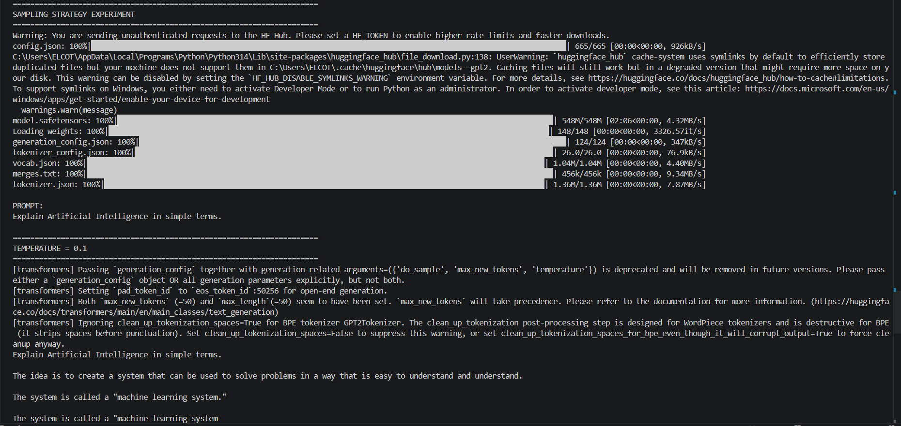
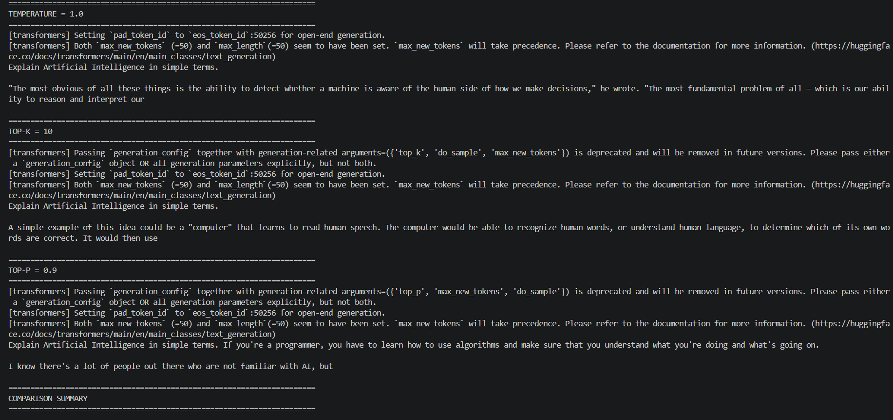
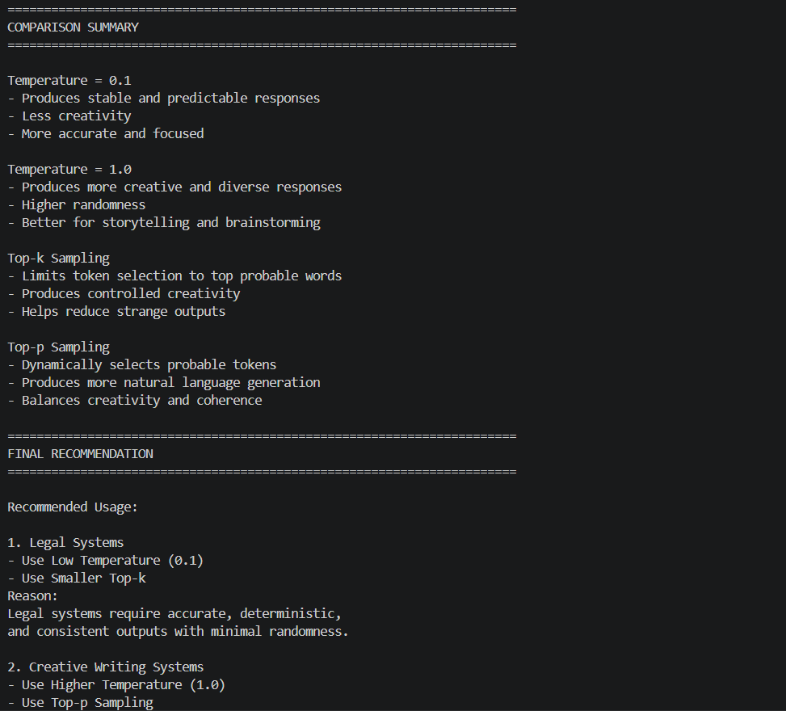
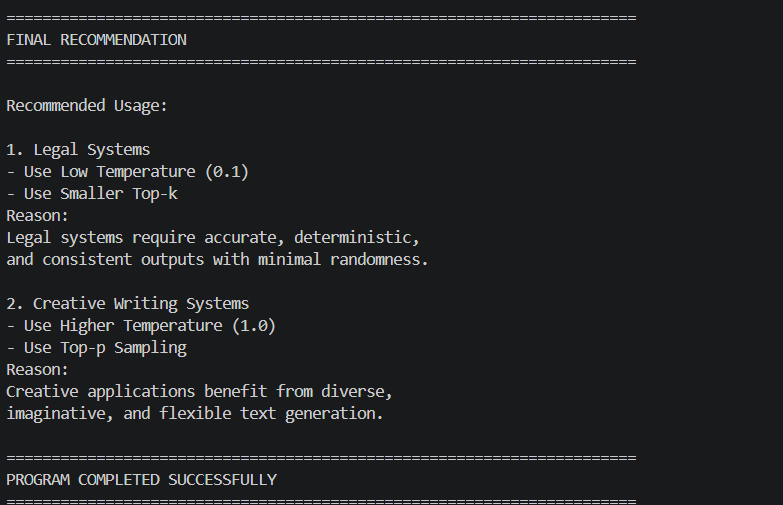

Sampling Strategy Experiment 🧠🎲

🚀 Built as a beginner-friendly implementation of LLM Sampling Strategies using Python, Hugging Face Transformers, and GPT-2

An educational AI project that demonstrates how Large Language Models (LLMs) generate different types of responses using various sampling strategies such as Temperature, Top-k, and Top-p sampling.

This project simulates how modern AI systems like GPT, Gemini, Claude, and LLaMA control creativity, randomness, coherence, and response diversity during text generation.

📖 Project Overview

The Sampling Strategy Experiment project is designed to help beginners understand how Large Language Models decide which word to generate next during AI text generation.

Instead of generating the same response every time, LLMs use different sampling techniques to control response behavior. These techniques influence whether the output becomes more deterministic, creative, focused, or diverse.

This project demonstrates:

How temperature affects randomness
How top-k sampling limits word selection
How top-p sampling dynamically controls probability selection
How AI responses change under different configurations
How sampling impacts creativity and stability in LLMs

The application uses the Hugging Face Transformers library with the GPT-2 model to simulate real-world text generation behavior used in Generative AI systems.

✨ Features

The project demonstrates the complete workflow of LLM sampling strategy experimentation including:

Temperature-based text generation
Top-k sampling
Top-p sampling
Response comparison across configurations
Controlled vs creative text generation
Real LLM inference using GPT-2
Console-based output formatting
Beginner-friendly explanation of decoding strategies
AI response diversity analysis

The project helps visualize how AI models internally control text generation behavior.

🧠 Technologies Used

This project combines Python programming with Large Language Model (LLM) inference concepts.

Main Technologies
Python
Hugging Face Transformers
GPT-2
PyTorch
Python Concepts Used
Functions
String processing
Conditional statements
Model inference
Text generation
Parameter tuning
NLP pipelines
⚙️ How the Project Works

The application first loads the GPT-2 language model and tokenizer using the Hugging Face Transformers library.

Next, a prompt is provided to the language model:

Explain Artificial Intelligence in simple terms.

The application then generates multiple outputs using different sampling configurations:

Temperature = 0.1
Temperature = 1.0
Top-k sampling
Top-p sampling

Each configuration changes how the AI selects the next token during generation.

The project compares all generated outputs side by side and explains how each sampling strategy affects:

Creativity
Randomness
Stability
Diversity
Coherence

Finally, the system prints a recommendation explaining which sampling strategy is suitable for legal systems and which is better for creative applications.

This simulates how real-world Generative AI systems control text generation behavior internally.

📥 Input Prompt

The project uses the following example prompt:

Input Prompt	Purpose
Explain Artificial Intelligence in simple terms.	Demonstrates LLM sampling strategies

🗺️ Example Console Output
======================================================================
SAMPLING STRATEGY EXPERIMENT
======================================================================
Warning: You are sending unauthenticated requests to the HF Hub. Please set a HF_TOKEN to enable higher rate limits and faster downloads.
config.json: 100%|█████████████████████████████████████████████████████████████████████████████████████████████████████████████| 665/665 [00:00<00:00, 926kB/s]
C:\Users\ELCOT\AppData\Local\Programs\Python\Python314\Lib\site-packages\huggingface_hub\file_download.py:138: UserWarning: `huggingface_hub` cache-system uses symlinks by default to efficiently store duplicated files but your machine does not support them in C:\Users\ELCOT\.cache\huggingface\hub\models--gpt2. Caching files will still work but in a degraded version that might require more space on your disk. This warning can be disabled by setting the `HF_HUB_DISABLE_SYMLINKS_WARNING` environment variable. For more details, see https://huggingface.co/docs/huggingface_hub/how-to-cache#limitations.
To support symlinks on Windows, you either need to activate Developer Mode or to run Python as an administrator. In order to activate developer mode, see this article: https://docs.microsoft.com/en-us/windows/apps/get-started/enable-your-device-for-development
  warnings.warn(message)
model.safetensors: 100%|████████████████████████████████████████████████████████████████████████████████████████████████████| 548M/548M [02:06<00:00, 4.32MB/s]
Loading weights: 100%|█████████████████████████████████████████████████████████████████████████████████████████████████████| 148/148 [00:00<00:00, 3326.57it/s]
generation_config.json: 100%|██████████████████████████████████████████████████████████████████████████████████████████████████| 124/124 [00:00<00:00, 347kB/s]
tokenizer_config.json: 100%|████████████████████████████████████████████████████████████████████████████████████████████████| 26.0/26.0 [00:00<00:00, 76.9kB/s]
vocab.json: 100%|█████████████████████████████████████████████████████████████████████████████████████████████████████████| 1.04M/1.04M [00:00<00:00, 4.40MB/s]
merges.txt: 100%|███████████████████████████████████████████████████████████████████████████████████████████████████████████| 456k/456k [00:00<00:00, 9.34MB/s]
tokenizer.json: 100%|█████████████████████████████████████████████████████████████████████████████████████████████████████| 1.36M/1.36M [00:00<00:00, 7.87MB/s]

PROMPT:
Explain Artificial Intelligence in simple terms.

======================================================================
TEMPERATURE = 0.1
======================================================================
[transformers] Passing `generation_config` together with generation-related arguments=({'do_sample', 'max_new_tokens', 'temperature'}) is deprecated and will be removed in future versions. Please pass either a `generation_config` object OR all generation parameters explicitly, but not both.
[transformers] Setting `pad_token_id` to `eos_token_id`:50256 for open-end generation.
[transformers] Both `max_new_tokens` (=50) and `max_length`(=50) seem to have been set. `max_new_tokens` will take precedence. Please refer to the documentation for more information. (https://huggingface.co/docs/transformers/main/en/main_classes/text_generation)
[transformers] Ignoring clean_up_tokenization_spaces=True for BPE tokenizer GPT2Tokenizer. The clean_up_tokenization post-processing step is designed for WordPiece tokenizers and is destructive for BPE (it strips spaces before punctuation). Set clean_up_tokenization_spaces=False to suppress this warning, or set clean_up_tokenization_spaces_for_bpe_even_though_it_will_corrupt_output=True to force cleanup anyway.
Explain Artificial Intelligence in simple terms.

The idea is to create a system that can be used to solve problems in a way that is easy to understand and understand.

The system is called a "machine learning system."

The system is called a "machine learning system

======================================================================
TEMPERATURE = 1.0
======================================================================
[transformers] Setting `pad_token_id` to `eos_token_id`:50256 for open-end generation.
[transformers] Both `max_new_tokens` (=50) and `max_length`(=50) seem to have been set. `max_new_tokens` will take precedence. Please refer to the documentation for more information. (https://huggingface.co/docs/transformers/main/en/main_classes/text_generation)
Explain Artificial Intelligence in simple terms.

"The most obvious of all these things is the ability to detect whether a machine is aware of the human side of how we make decisions," he wrote. "The most fundamental problem of all — which is our ability to reason and interpret our

======================================================================
TOP-K = 10
======================================================================
[transformers] Passing `generation_config` together with generation-related arguments=({'top_k', 'do_sample', 'max_new_tokens'}) is deprecated and will be removed in future versions. Please pass either a `generation_config` object OR all generation parameters explicitly, but not both.
[transformers] Setting `pad_token_id` to `eos_token_id`:50256 for open-end generation.
[transformers] Both `max_new_tokens` (=50) and `max_length`(=50) seem to have been set. `max_new_tokens` will take precedence. Please refer to the documentation for more information. (https://huggingface.co/docs/transformers/main/en/main_classes/text_generation)
Explain Artificial Intelligence in simple terms.

A simple example of this idea could be a "computer" that learns to read human speech. The computer would be able to recognize human words, or understand human language, to determine which of its own words are correct. It would then use

======================================================================
TOP-P = 0.9
======================================================================
[transformers] Passing `generation_config` together with generation-related arguments=({'top_p', 'max_new_tokens', 'do_sample'}) is deprecated and will be removed in future versions. Please pass either a `generation_config` object OR all generation parameters explicitly, but not both.
[transformers] Setting `pad_token_id` to `eos_token_id`:50256 for open-end generation.
[transformers] Both `max_new_tokens` (=50) and `max_length`(=50) seem to have been set. `max_new_tokens` will take precedence. Please refer to the documentation for more information. (https://huggingface.co/docs/transformers/main/en/main_classes/text_generation)
Explain Artificial Intelligence in simple terms. If you're a programmer, you have to learn how to use algorithms and make sure that you understand what you're doing and what's going on.

I know there's a lot of people out there who are not familiar with AI, but

======================================================================
COMPARISON SUMMARY
======================================================================

Temperature = 0.1
- Produces stable and predictable responses
- Less creativity
- More accurate and focused

Temperature = 1.0
- Produces more creative and diverse responses
- Higher randomness
- Better for storytelling and brainstorming

Top-k Sampling
- Limits token selection to top probable words
- Produces controlled creativity
- Helps reduce strange outputs

Top-p Sampling
- Dynamically selects probable tokens
- Produces more natural language generation
- Balances creativity and coherence

======================================================================
FINAL RECOMMENDATION
======================================================================

Recommended Usage:

1. Legal Systems
- Use Low Temperature (0.1)
- Use Smaller Top-k
Reason:
Legal systems require accurate, deterministic,
and consistent outputs with minimal randomness.

2. Creative Writing Systems
- Use Higher Temperature (1.0)
- Use Top-p Sampling
Reason:
Creative applications benefit from diverse,
imaginative, and flexible text generation.

======================================================================
PROGRAM COMPLETED SUCCESSFULLY
======================================================================
# 📸 Project Screenshots

## Sampling Output Screenshot 1

## Sampling Output Screenshot 2

## Sampling Output Screenshot 3

## Sampling Output Screenshot 4

📦 Installation

First, install the required packages:

pip install transformers torch
▶️ Running the Project

Run the Python file using:

python main.py

The application will automatically generate responses using different sampling strategies and compare the outputs in the console.

📂 Project Structure
sampling-strategy-experiment/
│
├── output_screenshots/
│   ├── sampling_output1.png
│   ├── sampling_output2.png
│   ├── sampling_output3.png
│   ├── sampling_output4.png
│
├── main.py
├── requirements.txt
├── README.md
└── .gitignore
🎯 Learning Outcomes

This project helps in understanding:

Sampling strategies in LLMs
Temperature parameter
Top-k sampling
Top-p sampling
Text generation randomness
AI creativity control
LLM inference behavior
Prompt-based generation
Transformer decoding strategies
Hugging Face model usage
🧮 Core LLM Concepts

The project demonstrates several important LLM concepts used in modern AI systems.

Temperature

Temperature controls randomness during text generation.

Low Temperature

Produces:

Stable responses
Predictable outputs
Less creativity

Example:

temperature=0.1
High Temperature

Produces:

Creative responses
Diverse outputs
More randomness

Example:

temperature=1.0
Top-k Sampling

Top-k limits the model to selecting words only from the top K most probable tokens.

Example:

top_k=10

This helps reduce strange or highly random outputs.

Top-p Sampling

Top-p dynamically selects tokens whose cumulative probability reaches a threshold.

Example:

top_p=0.9

This produces more natural and balanced text generation.

🚨 Important Notes

This project uses the GPT-2 language model from Hugging Face for educational purposes.

Real-world LLMs such as GPT, Gemini, Claude, and LLaMA use:

Much larger neural networks
Advanced decoding algorithms
Reinforcement learning
Multi-GPU distributed systems
Massive training datasets
Optimized inference pipelines

However, the core sampling logic remains fundamentally similar.

🔮 Future Improvements

This project can be improved further by adding:

Beam search decoding
Greedy decoding comparison
Streamlit web interface
Multi-model comparison
Real-time text generation UI
Token probability visualization
Response quality scoring
Temperature slider interface
Interactive LLM playground
👨‍💻 Conclusion

The Sampling Strategy Experiment project demonstrates how Large Language Models generate different styles of responses using decoding and sampling strategies such as Temperature, Top-k, and Top-p sampling.

By implementing text generation using Python and Hugging Face Transformers, this project provides a beginner-friendly introduction to one of the most important concepts behind modern Generative AI systems and Large Language Models.

It is a great project for students and beginners who want to understand how LLMs control creativity, randomness, and response generation behavior internally.

Author

Dharshini.A

