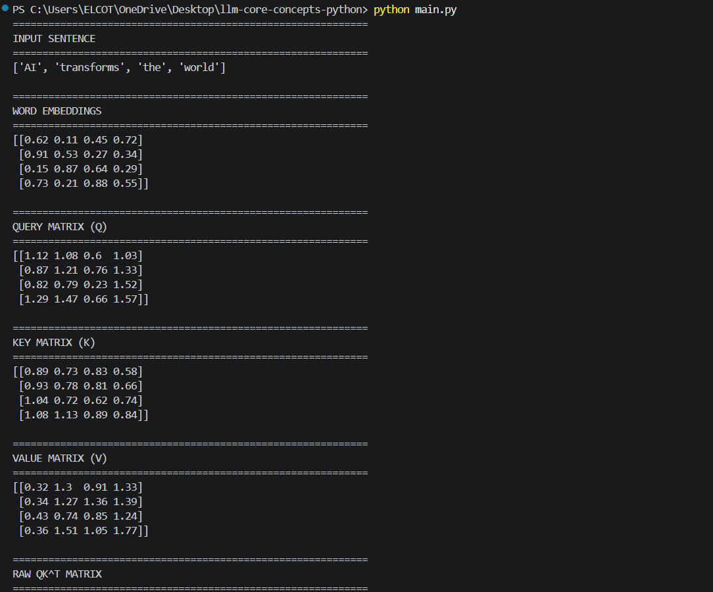
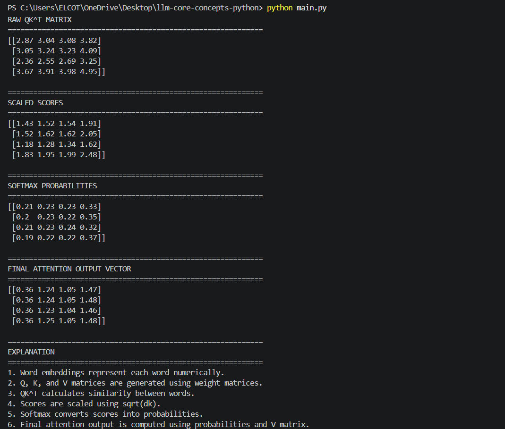

# Scaled Dot-Product Attention using NumPy 🧠⚡

> 🚀 Built as a beginner-friendly implementation of Transformer Attention Mechanism using Python and NumPy

An educational AI project that demonstrates how the Scaled Dot-Product Attention mechanism works internally inside modern Transformer models like GPT, Gemini, Claude, and LLaMA.

This project simulates the core attention process used in Large Language Models (LLMs) by generating Query (Q), Key (K), and Value (V) matrices from word embeddings and computing attention scores using NumPy.

---

# 📖 Project Overview

The Scaled Dot-Product Attention project is designed to help beginners understand the mathematical foundation behind Transformer architectures and modern Generative AI systems.

Instead of treating AI models like black boxes, this project demonstrates how language models mathematically understand relationships between words using vectors, similarity scores, scaling operations, and probability distributions.

The application takes a simple sentence, converts words into embeddings, computes attention relationships between words, and produces contextual attention outputs similar to the internal operations of Transformer-based models.

This project is inspired by the famous research paper:

**“Attention Is All You Need” (2017)**

which introduced the Transformer architecture that powers modern AI systems.

---

# ✨ Features

The project demonstrates the complete flow of scaled dot-product attention including:

* Word embedding representation
* Query (Q), Key (K), and Value (V) matrix generation
* Raw attention score calculation using QKᵀ
* Score scaling using √dk
* Softmax probability computation
* Final attention output generation
* Matrix multiplication using NumPy
* Clean console-based output formatting
* Beginner-friendly Transformer simulation

The project helps visualize how AI models determine which words are important while understanding a sentence.

---

# 🧠 Technologies Used

This project combines Python programming with fundamental Transformer mathematics.

## Main Technologies

* Python
* NumPy

## Python Concepts Used

* Arrays and matrices
* Matrix multiplication
* Functions
* Mathematical operations
* Softmax implementation
* Vector representation

---

# ⚙️ How the Project Works

The application first takes a sentence and splits it into individual words.

Each word is then converted into a numerical embedding vector representation. These embeddings are transformed into Query (Q), Key (K), and Value (V) matrices using weight matrices.

The attention mechanism calculates similarity scores between words using matrix multiplication:

Q × Kᵀ

The scores are then scaled using:

√dk

to stabilize computations.

Next, the softmax function converts the scaled scores into probability distributions that represent how much attention each word should give to other words.

Finally, the probabilities are multiplied with the Value matrix to generate the final contextual attention output.

The complete process simulates how Transformer models understand relationships between words in a sentence.

---

# 📥 Input Sentence

The project uses the following example sentence:

| Input                   | Purpose                          |
| ----------------------- | -------------------------------- |
| AI transforms the world | Demonstrates attention mechanism |

---

# 🗺️ Example Console Output

============================================================
INPUT SENTENCE
============================================================
['AI', 'transforms', 'the', 'world']

============================================================
WORD EMBEDDINGS
============================================================
[[0.62 0.11 0.45 0.72]
 [0.91 0.53 0.27 0.34]
 [0.15 0.87 0.64 0.29]
 [0.73 0.21 0.88 0.55]]

============================================================
QUERY MATRIX (Q)
============================================================
[[1.12 1.08 0.6  1.03]
 [0.87 1.21 0.76 1.33]
 [0.82 0.79 0.23 1.52]
 [1.29 1.47 0.66 1.57]]

============================================================
KEY MATRIX (K)
============================================================
[[0.89 0.73 0.83 0.58]
 [0.93 0.78 0.81 0.66]
 [1.04 0.72 0.62 0.74]
 [1.08 1.13 0.89 0.84]]

============================================================
VALUE MATRIX (V)
============================================================
[[0.32 1.3  0.91 1.33]
 [0.34 1.27 1.36 1.39]
 [0.43 0.74 0.85 1.24]
 [0.36 1.51 1.05 1.77]]

============================================================
RAW QK^T MATRIX
============================================================
[[2.87 3.04 3.08 3.82]
 [3.05 3.24 3.23 4.09]
 [2.36 2.55 2.69 3.25]
 [3.67 3.91 3.98 4.95]]

============================================================
SCALED SCORES
============================================================
[[1.43 1.52 1.54 1.91]
 [1.52 1.62 1.62 2.05]
 [1.18 1.28 1.34 1.62]
 [1.83 1.95 1.99 2.48]]

============================================================
SOFTMAX PROBABILITIES
============================================================
[[0.21 0.23 0.23 0.33]
 [0.2  0.23 0.22 0.35]
 [0.21 0.23 0.24 0.32]
 [0.19 0.22 0.22 0.37]]

============================================================
FINAL ATTENTION OUTPUT VECTOR
============================================================
[[0.36 1.24 1.05 1.47]
 [0.36 1.24 1.05 1.48]
 [0.36 1.23 1.04 1.46]
 [0.36 1.25 1.05 1.48]]

============================================================
EXPLANATION
============================================================
1. Word embeddings represent each word numerically.
2. Q, K, and V matrices are generated using weight matrices.
3. QK^T calculates similarity between words.
4. Scores are scaled using sqrt(dk).
5. Softmax converts scores into probabilities.
6. Final attention output is computed using probabilities and V matrix.
PS C:\Users\ELCOT\OneDrive\Desktop\llm-core-concepts-python> 
---

# 📸 Project Screenshots

## Attention Output Screenshot 1



## Attention Output Screenshot 2



# 📦 Installation

First, install the required package:

```bash
pip install numpy
```

---

# ▶️ Running the Project

Run the Python file using:

```bash
python main.py
```

The application will automatically compute and display all intermediate attention calculations in the console.

---

# 📂 Project Structure

```text
scaled-dot-product-attention/
│
├── output_screenshots/
│   ├── attention_output1.png
│   ├── attention_output2.png
│
├── main.py
├── requirements.txt
├── README.md
└── .gitignore
```

---

# 🎯 Learning Outcomes

This project helps in understanding:

* Transformer architecture fundamentals
* Attention mechanism internals
* Word embeddings
* Matrix multiplication in AI
* Query, Key, and Value concepts
* Probability distributions using softmax
* Contextual understanding in LLMs
* Core mathematical operations behind GPT models

---

# 🧮 Core Mathematical Concepts

The project demonstrates several important mathematical concepts used in modern AI systems:

## Attention Score Formula

```python
Q × Kᵀ
```

## Scaling Formula

```python
Scores / √dk
```

## Softmax Formula

The softmax function converts scores into probabilities where all values sum to 1.

---

# 🚨 Important Notes

This project is a simplified educational implementation of Transformer attention.

Real-world LLMs such as GPT and Gemini use:

* Much larger embedding dimensions
* Multi-head attention
* Positional encoding
* Billions of parameters
* Large-scale training datasets

However, the core attention logic remains fundamentally similar.

---

# 🔮 Future Improvements

This project can be improved further by adding:

* Multi-head attention
* Positional encoding
* Self-attention visualization
* Interactive GUI using Streamlit
* Sentence-level embeddings
* Attention heatmaps
* Transformer encoder simulation
* PyTorch implementation
* TensorFlow implementation

---

# 👨‍💻 Conclusion

The Scaled Dot-Product Attention project demonstrates how Transformer models mathematically understand language using vectors, similarity calculations, and probability distributions.

By implementing the attention mechanism using Python and NumPy, this project provides a beginner-friendly introduction to the internal working principles behind modern Large Language Models (LLMs).

It is a great project for students and beginners who want to understand the mathematical foundation of Transformer-based AI systems and Generative AI technologies.

Author
Dharshini.A