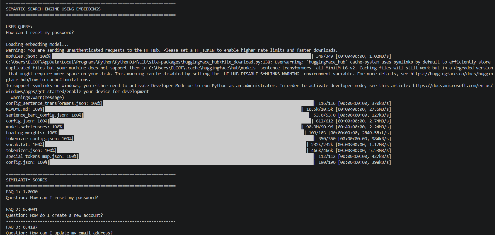
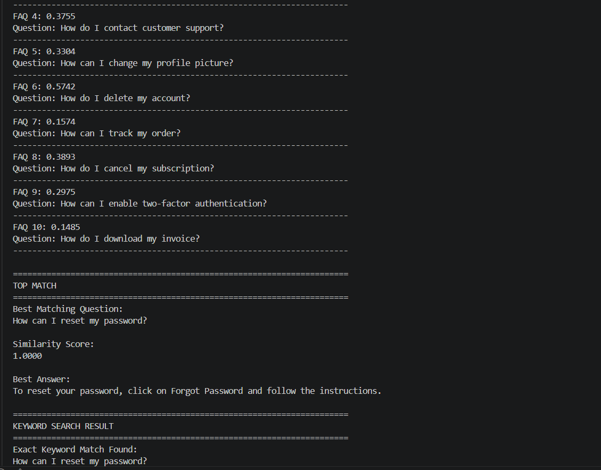
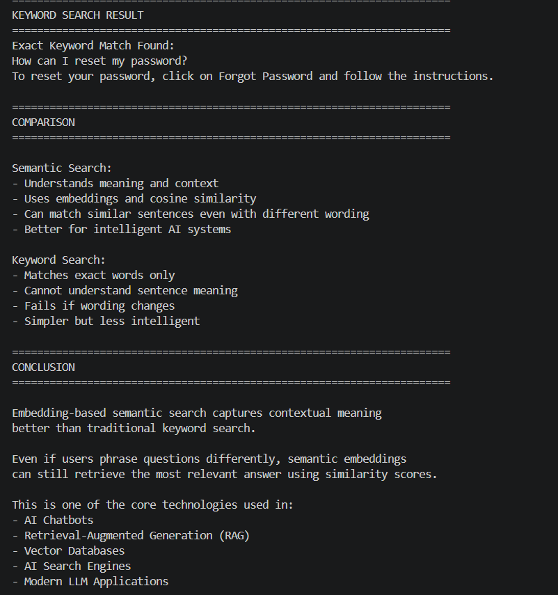
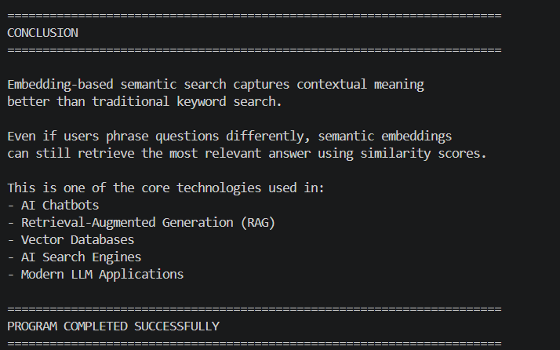

Semantic Search Engine Using Embeddings 🧠📚

🚀 Built as a beginner-friendly implementation of Semantic Search, Sentence Embeddings, Cosine Similarity, and FAQ Retrieval using Python and Sentence Transformers.

An educational AI project that demonstrates how modern AI systems understand the meaning of user queries instead of simply matching exact keywords.

This project simulates how intelligent AI applications such as ChatGPT, Google Semantic Search, Retrieval-Augmented Generation (RAG) systems, AI Chatbots, and Vector Databases retrieve contextually relevant information using embeddings and similarity calculations.

📖 Project Overview

The Semantic Search Engine Using Embeddings project is designed to help beginners understand one of the most important concepts behind modern AI retrieval systems: semantic similarity.

Traditional keyword search systems only check whether exact words exist inside a sentence. However, modern AI systems understand the meaning and context of text using vector embeddings.

This project demonstrates how AI can retrieve relevant answers even when the user uses different wording.

For example:

User Query:

"How can I recover my account password?"

can still match the FAQ:

"How can I reset my password?"

even though the words are not exactly identical.

This is possible because embedding models convert text into high-dimensional numerical vectors that capture semantic meaning.

The project uses the Sentence Transformers library with the all-MiniLM-L6-v2 embedding model from Hugging Face to simulate real-world semantic search behavior.

✨ Features

The project demonstrates the complete workflow of semantic search and embedding-based retrieval including:

FAQ dataset creation
Sentence embedding generation
Cosine similarity calculation
Semantic similarity comparison
Top matching FAQ retrieval
Similarity score printing
Keyword search implementation
Semantic vs keyword search comparison
Intelligent contextual retrieval
Beginner-friendly AI retrieval workflow explanation
Clean console-based output formatting

The project helps visualize how modern AI systems understand sentence meaning internally before retrieving responses.

🧠 Technologies Used

This project combines Python programming with Natural Language Processing (NLP), embeddings, and semantic retrieval concepts.

Main Technologies
Python
Sentence Transformers
Hugging Face Transformers
PyTorch
Scikit-learn
Python Concepts Used
Lists and dictionaries
Functions
Loops
String processing
Similarity calculations
Embedding vectors
Cosine similarity
Conditional statements
NLP preprocessing
⚙️ How the Project Works

The application first creates a list of Frequently Asked Questions (FAQs) and their answers.

Next, the Sentence Transformers embedding model is loaded using Hugging Face.

The system then converts all FAQ questions into embeddings (numerical vectors).

When the user enters a query, the application:

Converts the query into an embedding
Calculates cosine similarity between the query and all FAQs
Computes similarity scores
Finds the most semantically similar FAQ
Prints the best matching answer

The application also performs traditional keyword search for comparison purposes.

Finally, the system compares:

Semantic Search Results
Keyword Search Results

This demonstrates why embedding-based retrieval is significantly more powerful than simple keyword matching.

📥 Sample User Query

The project uses a sample user query:

User Query	Purpose
How can I reset my password?	Demonstrates semantic similarity retrieval
🗺️ Example Console Output
======================================================================
SEMANTIC SEARCH ENGINE USING EMBEDDINGS
======================================================================

USER QUERY:
How can I reset my password?

Loading embedding model...
Warning: You are sending unauthenticated requests to the HF Hub. Please set a HF_TOKEN to enable higher rate limits and faster downloads.
modules.json: 100%|███████████████████████████████████████████████████████████████████████████████████████████████████████████| 349/349 [00:00<00:00, 1.02MB/s]
C:\Users\ELCOT\AppData\Local\Programs\Python\Python314\Lib\site-packages\huggingface_hub\file_download.py:138: UserWarning: `huggingface_hub` cache-system uses symlinks by default to efficiently store duplicated files but your machine does not support them in C:\Users\ELCOT\.cache\huggingface\hub\models--sentence-transformers--all-MiniLM-L6-v2. Caching files will still work but in a degraded version that might require more space on your disk. This warning can be disabled by setting the `HF_HUB_DISABLE_SYMLINKS_WARNING` environment variable. For more details, see https://huggingface.co/docs/huggingface_hub/how-to-cache#limitations.
To support symlinks on Windows, you either need to activate Developer Mode or to run Python as an administrator. In order to activate developer mode, see this article: https://docs.microsoft.com/en-us/windows/apps/get-started/enable-your-device-for-development
  warnings.warn(message)
config_sentence_transformers.json: 100%|███████████████████████████████████████████████████████████████████████████████████████| 116/116 [00:00<00:00, 370kB/s]
README.md: 100%|██████████████████████████████████████████████████████████████████████████████████████████████████████████| 10.5k/10.5k [00:00<00:00, 27.6MB/s]
sentence_bert_config.json: 100%|█████████████████████████████████████████████████████████████████████████████████████████████| 53.0/53.0 [00:00<00:00, 127kB/s]
config.json: 100%|████████████████████████████████████████████████████████████████████████████████████████████████████████████| 612/612 [00:00<00:00, 2.74MB/s]
model.safetensors: 100%|██████████████████████████████████████████████████████████████████████████████████████████████████| 90.9M/90.9M [00:40<00:00, 2.24MB/s]
Loading weights: 100%|█████████████████████████████████████████████████████████████████████████████████████████████████████| 103/103 [00:00<00:00, 2849.58it/s]
tokenizer_config.json: 100%|███████████████████████████████████████████████████████████████████████████████████████████████████| 350/350 [00:00<00:00, 984kB/s]
vocab.txt: 100%|████████████████████████████████████████████████████████████████████████████████████████████████████████████| 232k/232k [00:00<00:00, 1.17MB/s]
tokenizer.json: 100%|███████████████████████████████████████████████████████████████████████████████████████████████████████| 466k/466k [00:00<00:00, 5.53MB/s]
special_tokens_map.json: 100%|█████████████████████████████████████████████████████████████████████████████████████████████████| 112/112 [00:00<00:00, 427kB/s]
config.json: 100%|█████████████████████████████████████████████████████████████████████████████████████████████████████████████| 190/190 [00:00<00:00, 398kB/s]

======================================================================
SIMILARITY SCORES
======================================================================
FAQ 1: 1.0000
Question: How can I reset my password?
----------------------------------------------------------------------
FAQ 2: 0.4091
Question: How do I create a new account?
----------------------------------------------------------------------
FAQ 3: 0.4187
Question: How can I update my email address?
----------------------------------------------------------------------
FAQ 4: 0.3755
Question: How do I contact customer support?
----------------------------------------------------------------------
FAQ 5: 0.3304
Question: How can I change my profile picture?
----------------------------------------------------------------------
FAQ 6: 0.5742
Question: How do I delete my account?
----------------------------------------------------------------------
FAQ 7: 0.1574
Question: How can I track my order?
----------------------------------------------------------------------
FAQ 8: 0.3893
Question: How do I cancel my subscription?
----------------------------------------------------------------------
FAQ 9: 0.2975
Question: How can I enable two-factor authentication?
----------------------------------------------------------------------
FAQ 10: 0.1485
Question: How do I download my invoice?
----------------------------------------------------------------------

======================================================================
TOP MATCH
======================================================================
Best Matching Question:
How can I reset my password?

Similarity Score:
1.0000

Best Answer:
To reset your password, click on Forgot Password and follow the instructions.

======================================================================
KEYWORD SEARCH RESULT
======================================================================
Exact Keyword Match Found:
How can I reset my password?
To reset your password, click on Forgot Password and follow the instructions.

======================================================================
COMPARISON
======================================================================

Semantic Search:
- Understands meaning and context
- Uses embeddings and cosine similarity
- Can match similar sentences even with different wording
- Better for intelligent AI systems

Keyword Search:
- Matches exact words only
- Cannot understand sentence meaning
- Fails if wording changes
- Simpler but less intelligent

======================================================================
CONCLUSION
======================================================================

Embedding-based semantic search captures contextual meaning
better than traditional keyword search.

Even if users phrase questions differently, semantic embeddings
can still retrieve the most relevant answer using similarity scores.

This is one of the core technologies used in:
- AI Chatbots
- Retrieval-Augmented Generation (RAG)
- Vector Databases
- AI Search Engines
- Modern LLM Applications

======================================================================
PROGRAM COMPLETED SUCCESSFULLY
======================================================================

Embedding-based semantic search captures contextual meaning
better than traditional keyword search.
# 📸 Project Screenshots

## Sementic Search output Screenshot 1

## Sementic Search output Screenshot 2

## Sementic Search output Screenshot 3

## Sementic Search output Screenshot 4

📦 Installation

First, install the required packages:

pip install sentence-transformers transformers torch scikit-learn
▶️ Running the Project

Run the Python file using:

python main.py

The application will automatically:

Generate embeddings
Calculate cosine similarity
Retrieve top matching FAQs
Compare semantic search with keyword search
Print similarity scores and final conclusions
📂 Project Structure
semantic-search-engine-using-embeddings/
│
├── output_screenshots/
│   ├── semantic_search_output1.png
│   ├── semantic_search_output2.png
│   ├── semantic_search_output3.png
│   ├── semantic_search_output4.png
│
├── main.py
├── requirements.txt
├── README.md
└── .gitignore
🎯 Learning Outcomes

This project helps in understanding:

Semantic Search
Sentence Embeddings
Cosine Similarity
NLP Retrieval Systems
Vector Representations
AI-based Information Retrieval
Contextual Similarity
FAQ Retrieval Systems
Embedding Models
Hugging Face Embedding Usage
AI Search Workflows
Retrieval-Augmented Generation (RAG) basics
🧮 Core AI Concepts

The project demonstrates several important AI and NLP concepts used in modern intelligent retrieval systems.

Sentence Embeddings

Sentence embeddings convert text into numerical vectors that capture semantic meaning.

Example:

"How can I reset my password?"

is converted into a mathematical vector representation.

AI models compare these vectors to identify semantic similarity between sentences.

Semantic Search

Semantic search understands the meaning and intent behind a sentence instead of matching exact words only.

Example:

"Recover my account password"

can still match:

"Reset my password"

because both sentences share similar meaning.

Cosine Similarity

Cosine similarity measures how similar two embedding vectors are.

Similarity scores range between:

Score	Meaning
1.0	Very similar
0.0	Completely different

Higher scores indicate stronger semantic similarity.

Keyword Search

Keyword search only checks for exact words.

Example:

"reset password"

matches only if the same keywords exist.

It cannot understand contextual meaning or sentence intent.

Semantic Search vs Keyword Search
Semantic Search	Keyword Search
Understands meaning	Matches exact words
Uses embeddings	Uses text matching
Intelligent retrieval	Basic retrieval
Works with different wording	Fails on wording changes
Used in modern AI systems	Used in traditional search
🚨 Important Notes

This project uses the all-MiniLM-L6-v2 embedding model from Sentence Transformers for educational purposes.

Real-world AI retrieval systems such as ChatGPT, Gemini, Claude, Perplexity AI, and Vector Databases use:

Much larger embedding models
Large-scale vector databases
Distributed retrieval systems
Advanced ranking algorithms
Hybrid search architectures
Retrieval-Augmented Generation (RAG)

However, the core semantic embedding workflow remains fundamentally similar.

🔮 Future Improvements

This project can be improved further by adding:

Vector database integration
FAISS similarity search
Pinecone vector storage
ChromaDB integration
Streamlit web interface
Real-time chatbot retrieval
Multi-language embeddings
Voice-based semantic search
Semantic ranking dashboard
RAG pipeline integration
PDF document retrieval
Web-based AI search engine
👨‍💻 Conclusion

The Semantic Search Engine Using Embeddings project demonstrates how modern AI systems retrieve information using semantic understanding instead of exact keyword matching.

By implementing embeddings and cosine similarity using Python and Sentence Transformers, this project provides a beginner-friendly introduction to one of the most important technologies behind modern AI retrieval systems and LLM applications.

It is a great project for students and beginners who want to understand how AI systems perform intelligent search, contextual retrieval, and semantic matching in real-world applications.

Author

Dharshini.A

