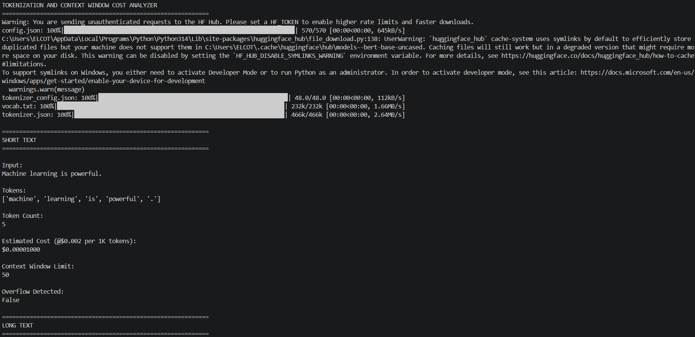
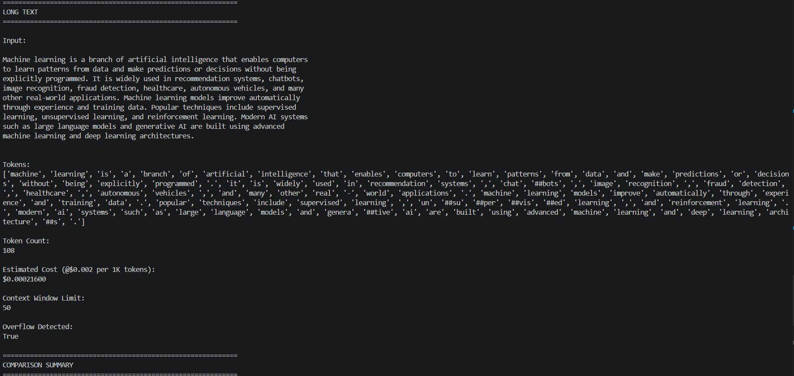
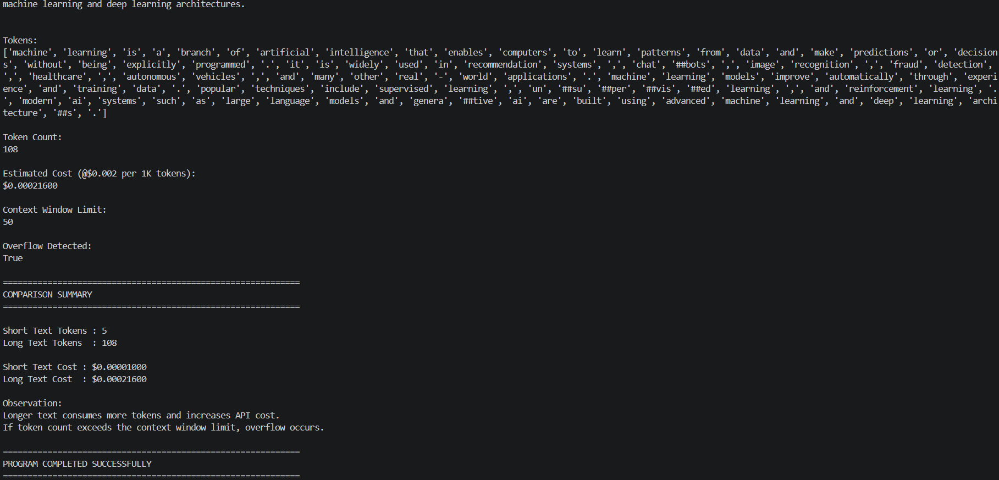

Tokenization and Context Window Cost Analyzer 🧠💬

🚀 Built as a beginner-friendly implementation of Tokenization, Context Window, and Token Cost Analysis using Python, Hugging Face Transformers, and BERT Tokenizer

An educational AI project that demonstrates how Large Language Models (LLMs) process text into tokens, estimate API costs, and handle context window limitations internally.

This project simulates how modern AI systems like GPT, Gemini, Claude, and LLaMA break sentences into smaller tokens and calculate token usage during AI inference.

📖 Project Overview

The Tokenization and Context Window Cost Analyzer project is designed to help beginners understand one of the most important concepts behind modern Large Language Models (LLMs): tokenization.

Instead of directly understanding words like humans, AI models first convert text into smaller numerical text units called tokens. These tokens are then processed internally by Transformer architectures.

This project demonstrates:

How text is split into tokens
How token count affects API cost
How context window limits work
How overflow occurs when token limits are exceeded
How subword tokenization works in NLP systems

The application uses the Hugging Face Transformers library with the BERT tokenizer to simulate real-world LLM tokenization behavior.

✨ Features

The project demonstrates the complete workflow of tokenization and token cost analysis including:

Text tokenization using BERT tokenizer
Short text vs long text comparison
Token counting
Context window simulation
Overflow detection
API cost estimation
Subword tokenization visualization
Clean console-based output formatting
Beginner-friendly NLP workflow explanation

The project helps visualize how AI models process language internally before generating responses.

🧠 Technologies Used

This project combines Python programming with Natural Language Processing (NLP) concepts.

Main Technologies
Python
Hugging Face Transformers
PyTorch
Python Concepts Used
Tokenization
Lists and arrays
Functions
String processing
Cost calculation
Conditional statements
NLP preprocessing
⚙️ How the Project Works

The application first loads the BERT tokenizer using the Hugging Face Transformers library.

Next, two different text samples are provided:

A short text
A long paragraph

The tokenizer splits the text into smaller tokens based on NLP tokenization rules.

The project then calculates:

Total token count
Estimated API cost
Context window usage
Overflow detection status

If the token count exceeds the defined context window limit, the system marks it as overflow.

The application finally compares short and long text token usage and demonstrates how larger prompts consume more AI resources and API cost.

This simulates how real-world LLM systems manage token limits internally.

📥 Input Text Samples

The project uses two example text inputs:

Input Type	Purpose
Short Text	Demonstrates small token usage
Long Text	Demonstrates large token usage and overflow

🗺️ Example Console Output
============================================================
TOKENIZATION AND CONTEXT WINDOW COST ANALYZER
============================================================
Warning: You are sending unauthenticated requests to the HF Hub. Please set a HF_TOKEN to enable higher rate limits and faster downloads.
config.json: 100%|███████████████████████████████████████████████████████████████████| 570/570 [00:00<00:00, 645kB/s]
C:\Users\ELCOT\AppData\Local\Programs\Python\Python314\Lib\site-packages\huggingface_hub\file_download.py:138: UserWarning: `huggingface_hub` cache-system uses symlinks by default to efficiently store duplicated files but your machine does not support them in C:\Users\ELCOT\.cache\huggingface\hub\models--bert-base-uncased. Caching files will still work but in a degraded version that might require more space on your disk. This warning can be disabled by setting the `HF_HUB_DISABLE_SYMLINKS_WARNING` environment variable. For more details, see https://huggingface.co/docs/huggingface_hub/how-to-cache#limitations.
To support symlinks on Windows, you either need to activate Developer Mode or to run Python as an administrator. In order to activate developer mode, see this article: https://docs.microsoft.com/en-us/windows/apps/get-started/enable-your-device-for-development
  warnings.warn(message)
tokenizer_config.json: 100%|███████████████████████████████████████████████████████| 48.0/48.0 [00:00<00:00, 112kB/s]
vocab.txt: 100%|██████████████████████████████████████████████████████████████████| 232k/232k [00:00<00:00, 1.66MB/s]
tokenizer.json: 100%|█████████████████████████████████████████████████████████████| 466k/466k [00:00<00:00, 2.64MB/s]

============================================================
SHORT TEXT
============================================================

Input:
Machine learning is powerful.

Tokens:
['machine', 'learning', 'is', 'powerful', '.']

Token Count:
5

Estimated Cost (@$0.002 per 1K tokens):
$0.00001000

Context Window Limit:
50

Overflow Detected:
False

============================================================
LONG TEXT
============================================================

Input:

Machine learning is a branch of artificial intelligence that enables computers
to learn patterns from data and make predictions or decisions without being
explicitly programmed. It is widely used in recommendation systems, chatbots,
image recognition, fraud detection, healthcare, autonomous vehicles, and many
other real-world applications. Machine learning models improve automatically
through experience and training data. Popular techniques include supervised
learning, unsupervised learning, and reinforcement learning. Modern AI systems
such as large language models and generative AI are built using advanced
machine learning and deep learning architectures.

Tokens:
['machine', 'learning', 'is', 'a', 'branch', 'of', 'artificial', 'intelligence', 'that', 'enables', 'computers', 'to', 'learn', 'patterns', 'from', 'data', 'and', 'make', 'predictions', 'or', 'decisions', 'without', 'being', 'explicitly', 'programmed', '.', 'it', 'is', 'widely', 'used', 'in', 'recommendation', 'systems', ',', 'chat', '##bots', ',', 'image', 'recognition', ',', 'fraud', 'detection', ',', 'healthcare', ',', 'autonomous', 'vehicles', ',', 'and', 'many', 'other', 'real', '-', 'world', 'applications', '.', 'machine', 'learning', 'models', 'improve', 'automatically', 'through', 'experience', 'and', 'training', 'data', '.', 'popular', 'techniques', 'include', 'supervised', 'learning', ',', 'un', '##su', '##per', '##vis', '##ed', 'learning', ',', 'and', 'reinforcement', 'learning', '.', 'modern', 'ai', 'systems', 'such', 'as', 'large', 'language', 'models', 'and', 'genera', '##tive', 'ai', 'are', 'built', 'using', 'advanced', 'machine', 'learning', 'and', 'deep', 'learning', 'architecture', '##s', '.']

Token Count:
108

Estimated Cost (@$0.002 per 1K tokens):
$0.00021600

Context Window Limit:
50

Overflow Detected:
True

============================================================
COMPARISON SUMMARY
============================================================

Short Text Tokens : 5
Long Text Tokens  : 108

Short Text Cost : $0.00001000
Long Text Cost  : $0.00021600

Observation:
Longer text consumes more tokens and increases API cost.
If token count exceeds the context window limit, overflow occurs.

============================================================
PROGRAM COMPLETED SUCCESSFULLY
============================================================
# 📸 Project Screenshots

## Tokenizer Output Screenshot 1

## Tokenizer Output Screenshot 2

## Tokenizer Output Screenshot 3

📦 Installation

First, install the required packages:

pip install transformers torch
▶️ Running the Project

Run the Python file using:

python main.py

The application will automatically tokenize the text, calculate token counts, estimate API costs, and detect context window overflow.

📂 Project Structure
tokenization-context-window-analyzer/
│
├── output_screenshots/
│   ├── tokenizer_output1.png
│   ├── tokenizer_output2.png
│   ├── tokenizer_output3.png
│
├── main.py
├── requirements.txt
├── README.md
└── .gitignore
🎯 Learning Outcomes

This project helps in understanding:

Tokenization in NLP
Context window concepts
Token limits in LLMs
API cost estimation
Subword tokenization
Text preprocessing
Transformer input processing
Real-world LLM workflow
Hugging Face tokenizer usage
🧮 Core NLP Concepts

The project demonstrates several important NLP and LLM concepts used in modern AI systems.

Tokenization

Text is split into smaller units called tokens.

Example:

"Machine learning is powerful."

becomes:

['machine', 'learning', 'is', 'powerful', '.']
Subword Tokenization

Some words are split into smaller meaningful parts.

Example:

"chatbots"

becomes:

['chat', '##bots']

This helps AI models understand unknown or complex words efficiently.

Context Window

The context window defines the maximum number of tokens an AI model can process at one time.

If token count exceeds the limit, overflow occurs.

Token Cost Estimation

Many AI APIs charge users based on token usage.

Higher token counts increase processing cost.

🚨 Important Notes

This project uses the BERT tokenizer from Hugging Face for educational purposes.

Real-world LLMs such as GPT, Gemini, Claude, and LLaMA use:

Larger token vocabularies
Advanced tokenization strategies
Much larger context windows
Optimized Transformer architectures
Large-scale distributed systems

However, the core tokenization workflow remains fundamentally similar.

🔮 Future Improvements

This project can be improved further by adding:

GPT tokenizer integration
Real API token estimation
Streamlit web interface
Multi-language tokenization
Token visualization graphs
Cost comparison dashboard
Real-time prompt analyzer
PDF report export
Interactive tokenizer simulator
👨‍💻 Conclusion

The Tokenization and Context Window Cost Analyzer project demonstrates how Large Language Models internally process text using tokenization and context window mechanisms.

By implementing token analysis using Python and Hugging Face Transformers, this project provides a beginner-friendly introduction to one of the most important concepts behind modern AI systems and Generative AI applications.

It is a great project for students and beginners who want to understand how LLMs process text, manage token limits, and estimate computational cost in real-world AI systems.

Author

Dharshini.A

